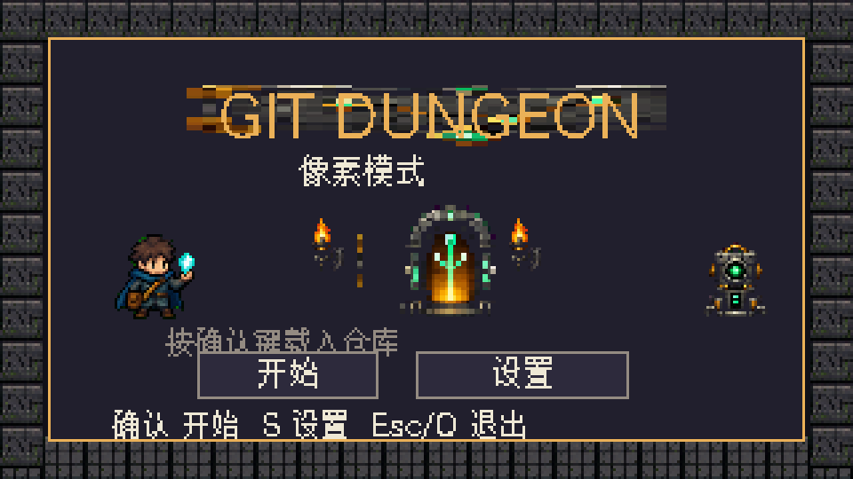
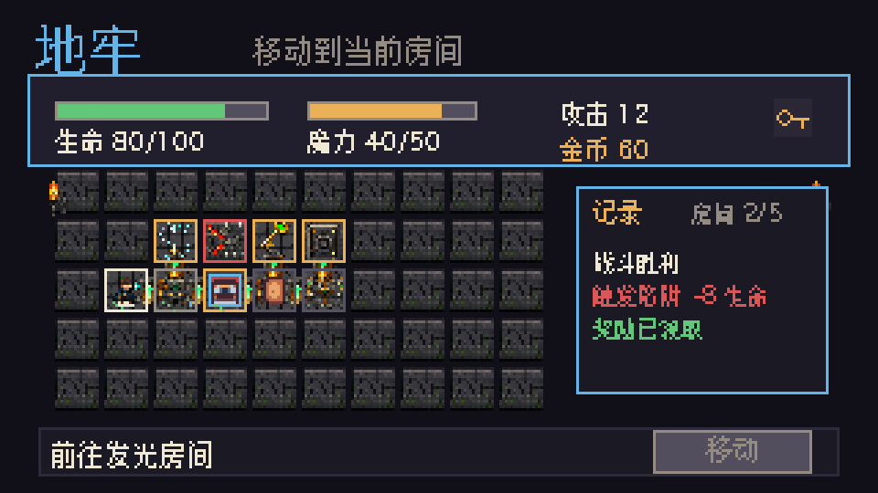
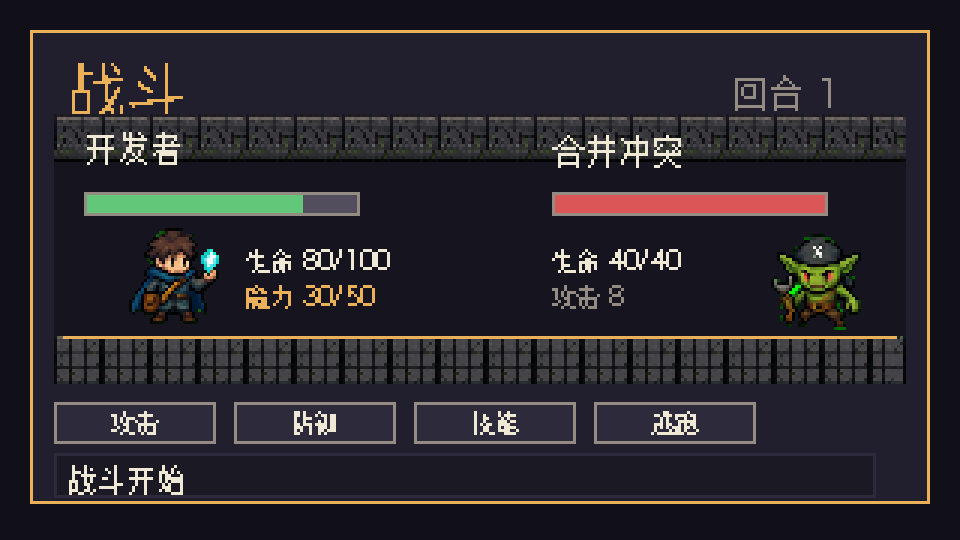
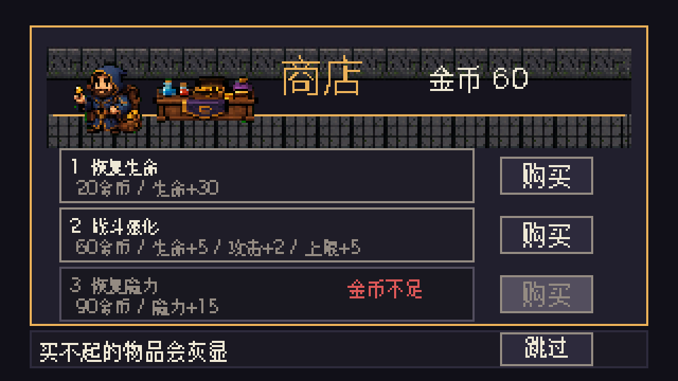

# Git Dungeon

[English](README.md) | [简体中文](README.zh-CN.md)

将 Git 提交历史映射为可游玩的 Roguelike，同时支持可复现的 CLI 模式和 PC 像素风模式。

## 项目是做什么的

`Git Dungeon` 会把仓库历史转换成一局可战斗流程：

- 每个 commit 对应一个敌人遭遇。
- commit 类型（`feat`、`fix`、`docs`、`merge`）影响章节风格和节奏。
- 战斗后获得 EXP/金币，升级并推进章节。
- PC 像素模式会把同一局游戏呈现为 tile 地牢，包含战斗、事件、商店、休息点、陷阱、奖励、暂停设置和首次游玩引导。
- 可选 AI 文案增强叙事，同时保留可复现与降级能力。

适用场景：

- 以游戏化方式浏览项目历史。
- 演示 Python CLI 中可复现玩法系统。
- 作为测试驱动 roguelike 架构参考实现。

## Pixel 模式预览

Pixel 模式是基于 Pygame-CE 的桌面 PC 前端。它复用 CLI 的确定性引擎，同时增加可视化地牢、键鼠操作、中文界面、音频、设置页和截图回归检查。

| 标题与首次引导 | 地牢探索 |
|---|---|
|  |  |

| 战斗界面 | 商店界面 |
|---|---|
|  |  |

## 玩法流程

1. 解析仓库 commits。
2. 构建章节与敌人。
3. 进行战斗（手动或 `--auto` 自动策略）。
4. 结算奖励并推进直到通关或失败。

## 输出示例（不启用 AI）

```text
Loading repository...
Loaded 248 commits!
Divided into 20 chapters:
  🔄 Chapter 0: 混沌初开 (initial)
  ⏳ Chapter 1: 修复时代 (fix)

⚔️  混沌初开: fix bug [compact]
T01 action=attack dealt=14 taken=3 hp=97/100 enemy=6/20
T02 action=skill dealt=9 taken=0 hp=97/100 enemy=0/20 [KILL]
   ✨[KILL] fix bug defeated
📊 Metrics written: ./run_metrics.json
```

## 输出示例（启用 AI）

```text
[AI] enabled provider=mock
🧠 一个 fix 类型敌人正在逼近，能量波动异常。
🧠 战斗开始，准备你的下一步行动。
⚔️  混沌初开: fix parser bug
T01 action=skill dealt=16 taken=0 hp=100/100 enemy=4/20 [CRIT]
...
```

## 当前版本

- `1.2.0`
- 版本策略：`SemVer`
- 升级说明：`CHANGELOG.md`

## 快速开始（3 步）

1. 创建并激活干净虚拟环境。

```bash
python3 -m venv .venv
source .venv/bin/activate
```

2. 从 wheel 安装。

```bash
python -m pip install --upgrade pip build
python -m build --wheel
pip install dist/*.whl
```

3. 运行可复现 demo。

```bash
git-dungeon . --seed 42 --auto --compact --metrics-out ./run_metrics.json
```

推荐第一条体验命令（约 1 分钟）：

```bash
git-dungeon . --seed 42 --auto --compact --print-metrics
```

运行 PC 像素界面：

```bash
pip install -e ".[pixel]"
PYTHONPATH=src python -m git_dungeon . --pixel --seed 42 --lang zh_CN
```

## 常用参数

- `--auto`：自动战斗决策。
- `--compact`：每回合紧凑摘要输出。
- `--metrics-out <path>`：输出指标 JSON。
- `--print-metrics`：打印本局指标摘要。
- `--seed <int>`：固定随机种子。
- `--pixel`：运行 PC-only 的 Pygame 像素界面。
- `--headless --auto`：不打开窗口运行 pixel 入口，用于 smoke 检查。
- `--ai=off|on --ai-provider=mock|gemini|openai|copilot`：AI 文案开关与提供方。
- `--ai-model <id>`：覆盖远端 provider 默认模型，例如 `openai/o4-mini`。

## 内容包与挑战模式

通过路径加载示例内容包：

```bash
git-dungeon . --content-pack content_packs/example_pack --seed 42 --auto --compact
```

通过环境变量目录自动发现内容包（子目录）：

```bash
export GIT_DUNGEON_CONTENT_DIR=./content_packs
git-dungeon . --content-pack example_pack --seed 42 --auto --compact
```

每日挑战（可分享 run id）：

```bash
git-dungeon . --daily --mutator hard --auto --compact
```

固定日期的每日挑战（便于复现）：

```bash
git-dungeon . --daily --daily-date 2026-02-06 --auto --compact
```

内容包合并优先级：

- 后加载覆盖先加载（`cards/relics/events/chapter_overrides`）。
- `--content-pack` 参数顺序即合并顺序。
- `GIT_DUNGEON_CONTENT_DIR` 中的包会在 CLI 包之后按目录名排序合并。

贡献说明见：`docs/CONTENT_PACKS.md`。

## AI 文案示例（可选）

使用可复现的 mock 提供方开启 AI 文案：

```bash
git-dungeon . --ai=on --ai-provider=mock --auto --compact
```

启用 Gemini：

```bash
export GEMINI_API_KEY="your-key"
git-dungeon . --ai=on --ai-provider=gemini --lang zh_CN
```

启用 OpenAI：

```bash
export OPENAI_API_KEY="your-key"
git-dungeon . --ai=on --ai-provider=openai --lang zh_CN
```

启用 Copilot / GitHub Models：

```bash
export GITHUB_TOKEN="ghp_xxx"
# 可选：指定 GitHub Models 模型 ID
export GITHUB_MODELS_MODEL="openai/gpt-4.1-mini"
git-dungeon . --ai=on --ai-provider=copilot --ai-model=openai/o4-mini --lang zh_CN
```

示例输出：

```text
[AI] enabled provider=mock
🧠 一个 fix 类型敌人正在逼近，能量波动异常。
🧠 战斗开始，准备你的下一步行动。
⚔️  混沌初开: fix parser bug
...
```

`mock` 适合 CI 与离线演示；远端 provider 限流时会安全降级。详见 `docs/AI_TEXT.md`。

## 存档目录

默认：

- `~/.local/share/git-dungeon`

可覆盖：

```bash
export GIT_DUNGEON_SAVE_DIR=/tmp/git-dungeon-saves
```

## Demo 命令

```bash
git-dungeon . --auto
git-dungeon . --seed 42 --auto --compact --print-metrics
PYTHONPATH=src python -m git_dungeon . --pixel --seed 42 --lang zh_CN
git-dungeon . --auto --lang zh_CN
git-dungeon . --content-pack content_packs/example_pack --seed 42 --auto --compact
git-dungeon . --daily --mutator hard --auto --compact
```

## 开发命令

```bash
make lint
make test
make test-func
make test-golden
make build-wheel
make smoke-install
```

Pixel 界面检查：

```bash
PYTHONPATH=src python scripts/verify_assets.py --strict
PYTHONPATH=src python scripts/verify_audio.py
SDL_VIDEODRIVER=dummy SDL_AUDIODRIVER=dummy PYTHONPATH=src python scripts/render_pixel_screens.py --out-dir /tmp/git-dungeon-pixel-screens --scale 2
```

## 文档

- `CHANGELOG.md`
- `docs/FAQ.md`
- `docs/CONTENT_PACKS.md`
- `docs/perf.md`
- `docs/AI_TEXT.md`
- `docs/TESTING_FRAMEWORK.md`
- `plans/pixel-pc-release-checklist.md`

## License

MIT (`LICENSE`)
